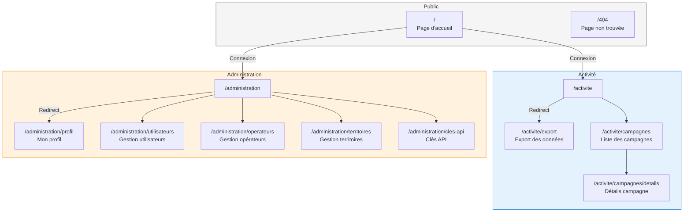

# App-Partners - Documentation Technique

Portail partenaires pour la gestion des incitations au covoiturage. Application destinée aux collectivités territoriales et aux opérateurs.

> **Note** : Le Tech Lead est la personne référente pour les questions techniques sur ce projet. Le Backup peut répondre en son absence.

## Stack Technique

| Élément    | Technologie                           |
| ---------- | ------------------------------------- |
| Framework  | Next.js 15.3 (App Router)             |
| Langage    | TypeScript 5                          |
| UI         | DSFR (Design System FR) + Material-UI |
| Validation | Zod                                   |
| Graphiques | Chart.js                              |
| Analytics  | Matomo                                |
| Styling    | SCSS                                  |

## Structure du Projet

```
src/
├── app/                    # Pages Next.js (App Router)
│   ├── activite/           # Exports, campagnes
│   └── administration/     # Utilisateurs, territoires, opérateurs
├── components/             # Composants React réutilisables
├── hooks/api/              # Hooks API (useExportCreate, etc.)
├── interfaces/             # Types TypeScript
├── providers/              # Context providers (Auth)
├── config/                 # Configuration
├── helpers/                # Fonctions utilitaires
└── styles/                 # SCSS global
```

## Installation & Lancement

### Prérequis

- Node.js
- npm
- **API backend lancée** : App-Partners dépend entièrement de l'API pour fonctionner. Avant de démarrer le frontend, lancez l'API depuis la racine du monorepo :

```bash
just dc up
```

> Voir le [README de l'API](../api/README.md) pour plus de détails.

### Commandes

```bash
# Développement
npm run dev          # http://localhost:4200

# Production
npm run build
npm run start

# Lint
npm run lint
```

## Configuration

### Variables d'environnement

Copier `.env.example` vers `.env.local` et configurer :

| Variable | Description |
| - | - |
| `NEXT_PUBLIC_API_URL` | URL de l'API backend |
| `NEXT_PUBLIC_API_REDIRECT` | URL de redirection API |
| `NEXT_PUBLIC_DATALAKE_BASE_URL` | URL de l'API datalake (recherche de territoires) |
| `NEXT_PUBLIC_PC_USER_URI` | URI utilisateur PC |

### Alias de chemin

Utiliser `@/` pour importer depuis `src/` :

```typescript
import { Button } from "@/components/Button";
```

## Pages Principales

### Diagramme de Navigation



### Description des Pages

#### Activité (`/activite`)

- **Export** (`/activite/export`) - Création et téléchargement d'exports de données avec filtres géographiques et temporels
- **Campagnes** (`/activite/campagnes`) - Suivi des campagnes d'incitation avec tableau paginé
- **Détails Campagne** (`/activite/campagnes/details`) - Vue détaillée avec graphiques d'évolution et consommation budget

#### Administration (`/administration`)

- **Profil** (`/administration/profil`) - Gestion du profil utilisateur, simulation de rôle (registry.admin)
- **Utilisateurs** (`/administration/utilisateurs`) - Gestion des utilisateurs (admins uniquement)
- **Territoires** (`/administration/territoires`) - Gestion des territoires (registry.admin uniquement)
- **Opérateurs** (`/administration/operateurs`) - Gestion des opérateurs (registry.admin uniquement)
- **Clés API** (`/administration/cles-api`) - Gestion des accès API (opérateurs uniquement)

## Conventions de Code

- **Hooks API** : `use[Feature][Action]` (ex: `useExportCreate`)
- **Prettier** : 120 caractères, double quotes, trailing commas
- **ESLint** : TypeScript strict

## Lien avec l'API

App-Partners est un **frontend pur** : il ne possède aucune base de données propre. Toutes les données (utilisateurs, campagnes, territoires, opérateurs, exports) proviennent de l'**API backend** du Registre de Preuve de Covoiturage.

- L'authentification se fait via l'API (`/login`) qui retourne un **token JWT** stocké en session
- Chaque requête inclut ce token pour validation
- Les appels API sont centralisés dans `src/hooks/api/` via des hooks custom (`use[Feature][Action]`)
- La configuration de l'URL de l'API se fait via `NEXT_PUBLIC_API_URL` dans `.env.local`
- Les helpers de requête se trouvent dans `src/helpers/`

## Extensions VSCode Recommandées

| Extension         | ID                          | Description                    |
| ----------------- | --------------------------- | ------------------------------ |
| ESLint            | `dbaeumer.vscode-eslint`    | Linting TypeScript/JavaScript  |
| Prettier          | `esbenp.prettier-vscode`    | Formatage automatique du code  |
| SCSS IntelliSense | `mrmlnc.vscode-scss`        | Autocomplétion SCSS            |
| EditorConfig      | `editorconfig.editorconfig` | Configuration éditeur partagée |

## Liens Utiles

- [DSFR Documentation](https://www.systeme-de-design.gouv.fr/)
- [React DSFR Storybook](https://components.react-dsfr.codegouv.studio/?path=/docs/components-button--default)
- [Next.js Documentation](https://nextjs.org/docs)

## Licence

DINUM / DGITM / ADEME, 2017-2026

Ce projet est développé sous licence [Apache license 2.0](./LICENSE).
